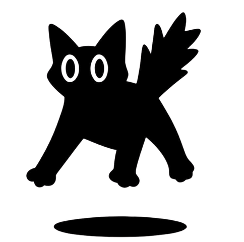

  
  <h1>AI Canvas </h1>

---

## 💡 Sobre o Projeto
O **AICanvas** é um ecossistema de cadernos digitais de código aberto (Open Source) desenvolvido especificamente para o **iPad**. Ele une a fluidez da escrita manual com o Apple Pencil ao poder da Inteligência Artificial.

A ideia principal é oferecer um ambiente minimalista e sem distrações onde você pode organizar vários cadernos, escrever usando a estética nativa em um canvas infinito com páginas tamanho A4 e utilizar diversas provedoras de IA Multimodal para acelerar seu aprendizado e resolução de problemas. Essa ferramenta atua como seu companheiro inteligente de estudos, capaz de compreender suas anotações manuais e diagramas complexos.

## ✨ Principais Funcionalidades
* **Estética Nativa Apple:** Experiência de escrita de baixa latência altamente otimizada, utilizando PencilKit para iPad e Apple Pencil.
* **Área de Trabalho Infinita:** Um canvas com rolagem infinita segmentado em páginas A4, com fundos customizáveis como linhas ou grade.
* **Exportação para PDF:** Exporte seu canvas infinito para PDF facilmente, capturando sua escrita junto com os padrões de fundo escolhidos (linhas/grades) para um compartilhamento perfeito.
* **Suporte a Dark Mode:** Totalmente otimizado para os modos claro e escuro, garantindo uma experiência de anotações confortável em qualquer ambiente.
* **Gerenciamento Inteligente de Cadernos:** Crie e gerencie múltiplos cadernos em uma interface em formato de grade (gamificada) com salvamento automático local.
* **Integração com IA Multimodal:** Um painel de chat com IA embutido que "enxerga" o seu canvas para te ajudar a:
    * Realizar cálculos matemáticos e de engenharia complexos a partir das suas fórmulas desenhadas à mão.
    * Resumir anotações manuais ou digitadas.
    * Explicar conceitos difíceis ou fornecer contexto extra analisando os seus rascunhos em tempo real.
* **Traga a sua Própria IA:** Adicione com segurança suas próprias chaves de API pelo Keychain para usar as IAs mais modernas do mercado, agora com uma interface de gerenciamento repaginada:
    * **Google Gemini** (Suporte à Visão Multimodal)
    * **OpenAI (ChatGPT)** (Suporte à Visão Multimodal)
    * **Anthropic Claude** (Suporte à Visão Multimodal)
    * **Groq** (Inferência rápida de texto)

## 🛠 Tecnologias
* **Frontend:** Swift, SwiftUI, PencilKit
* **Integração de IA:** APIs da Gemini, OpenAI, Claude e Groq
* **Persistência:** File System Local (JSON) para cadernos, Apple Keychain para armazenar as chaves de API com segurança.
* **Arquitetura:** Concorrência moderna do Swift com um padrão de design modular.

## 🚀 Como Começar
1. Clone o repositório: `git clone https://github.com/lucaspanzera/ai-canvas.git`
2. Abra o projeto no Xcode (requer Xcode 15+ e iOS/iPadOS 17+).
3. Execute o projeto no seu iPad ou Simulador.
4. No primeiro acesso, siga o processo de integração (onboarding) para adicionar suas Chaves de API de IA preferidas.

## 🤝 Contribuições
Contribuições são o que fazem a comunidade open-source um lugar incrível para aprender e criar. Sinta-se à vontade para abrir issues ou enviar pull requests!

---
Desenvolvido com ❤️ por [Lucas Panzera](https://github.com/lucaspanzera)